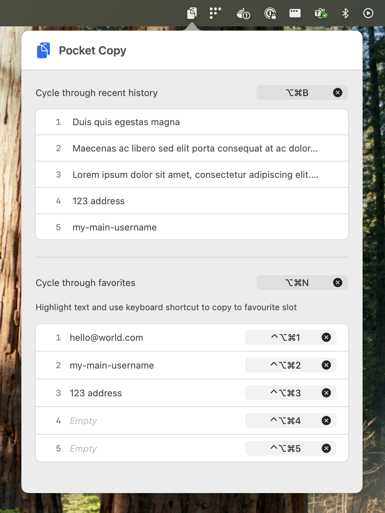

# PocketCopy

A minimal clipboard manager for macOS that lives in your menu bar.

## Features

- 📋 Track your last 5 clipboard items
- ⭐ Save up to 5 favorites with keyboard shortcuts
- ⌨️ Global keyboard shortcuts for quick access
- 🎯 Minimal and fast
- 🌓 Supports dark/light mode

## Installation

1. Download the latest version from [Releases](https://github.com/yourusername/PocketCopy/releases)
2. Unzip `PocketCopy.zip`
3. Drag `PocketCopy.app` to your Applications folder
4. Right-click and select "Open" (first time only, due to macOS security)
5. Look for the clipboard icon in your menu bar

## Usage

### Keyboard Shortcuts

- **Cycle Recent**: ⌘⇧B
- **Cycle Favorites**: ⌘⇧N
- **Save to Favorite 1-5**: ⌘⇧1 through ⌘⇧5

### Menu Bar

- Click the clipboard icon in your menu bar
- Select "Open PocketCopy" to view your clipboard history
- Select "Quit" to close the app

## Requirements

- macOS 11.0 or later
- Apple Silicon or Intel Mac

## Building from Source

1. Clone this repository
2. Open `PocketCopy.xcodeproj` in Xcode
3. Build and run (⌘R)

## Privacy

PocketCopy runs entirely on your Mac. No data is sent to any servers.

## License

MIT License - see [LICENSE](LICENSE) file

## Support

If you find this useful, consider ⭐ starring the repository!
